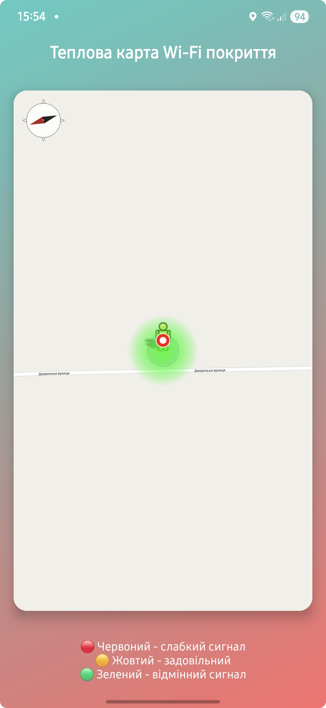
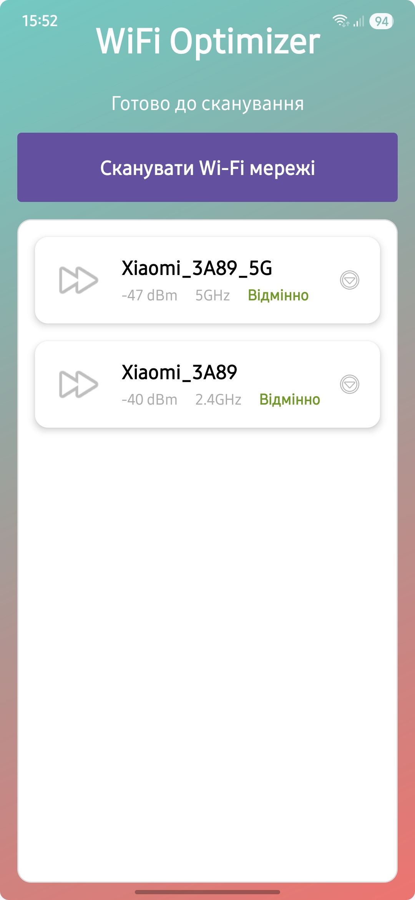

# OptiFi 📡

**OptiFi** — це Android-додаток для створення теплової карти покриття Wi-Fi мереж.  
Додаток дозволяє сканувати Wi-Fi мережі, відображати силу сигналу на карті за допомогою **OpenStreetMap** і надавати рекомендації для покращення з’єднання.  
Розроблено з урахуванням адаптивності для різних пристроїв, включаючи сучасні смартфони, такі як **Samsung A55**.

**Автор**: BunnyB\\Nazoferon  
**Дата створення**: 21 липня 2025

<p align="center">
  
</p>

---

## 🚀 Особливості

- 🔍 **Сканування Wi-Fi**: автоматичне сканування доступних мереж із визначенням сили сигналу.
- 🗺 **Теплова карта**: візуалізація покриття Wi-Fi з кольоровим кодуванням:
  - 🔴 слабкий (менше -70 dBm)
  - 🟡 задовільний (-70 до -60 dBm)
  - 🟢 відмінний (≥ -60 dBm)
- 📍 **Відстеження локації**: GPS + власна іконка користувача.
- 📱 **Адаптивний дизайн**: інтерфейс оптимізований для різних екранів і вирізів.
- 🧭 **Інтуїтивний інтерфейс**: проста навігація, статус сканування, підказки.

---

## 📸 Скріншоти

| Теплова карта Wi-Fi | Список мереж |
|---------------------|--------------|
|  |  |

---

## 🛠 Встановлення

1. **Склонуй репозиторій**:
   ```bash
   git clone https://github.com/Nazoferon/OptiFi.git

2. **Відкрий у Android Studio**:

   * Запусти Android Studio.
   * Обери `File > Open` та вкажи папку `OptiFi`.

3. **Налаштуй SDK**:

   * Відредагуй `local.properties`:

     ```
     sdk.dir=/шлях/до/твого/Android/Sdk
     ```

4. **Збери та запусти**:

   * `Build > Rebuild Project`
   * Обери пристрій або емулятор → `Run`

---

## 📋 Вимоги

* **Android**: 5.0 (API 21) або новіший
* **Дозволи**:

  * `ACCESS_FINE_LOCATION`
  * `ACCESS_WIFI_STATE`, `CHANGE_WIFI_STATE`
  * `INTERNET`, `ACCESS_NETWORK_STATE`
  * `WRITE_EXTERNAL_STORAGE`
* **Обладнання**: Пристрій із підтримкою Wi-Fi та GPS

---

## 🔧 Залежності

У `app/build.gradle` використовуються:

```gradle
implementation 'org.osmdroid:osmdroid-android:6.1.10'
implementation 'androidx.cardview:cardview:1.0.0'
implementation 'androidx.constraintlayout:constraintlayout:2.1.4'
implementation 'com.google.android.gms:play-services-location:21.0.1'
```

---

## 🖥 Використання

1. Запусти додаток.
2. Дозволь доступ до локації та Wi-Fi.
3. Обери Wi-Fi мережу у `MainActivity`.
4. У `CoverageMapActivity` переглянь теплову карту:

   * 🔴 < -70 dBm (слабкий)
   * 🟡 -70 до -60 dBm (задовільний)
   * 🟢 ≥ -60 dBm (відмінний)
5. Отримай поради в `RecommendationsActivity`.

---

## 🗂 Структура проєкту

```
app/src/main/java/com/example/optifi/
├── MainActivity.java              // Список Wi-Fi мереж
├── CoverageMapActivity.java       // Теплова карта + OpenStreetMap
├── NetworkDetailActivity.java     // Деталі мережі
├── RecommendationsActivity.java   // Рекомендації
├── WifiScanner.java               // Сканування Wi-Fi
└── HeatMapOverlay.java            // Накладання теплової карти
```

```
app/src/main/res/
├── layout/                        // XML-лейаути
│   ├── activity_main.xml
│   ├── activity_coverage_map.xml
│   └── ...
├── drawable/                      // Графічні ресурси
│   ├── gradient_background.xml
│   ├── ic_user_location.xml
│   └── ...
└── mipmap/                        // Іконки
    ├── ic_launcher.png
    └── ic_launcher_foreground.png
```

---

## 🤝 Як внести вклад

1. Форкни репозиторій.
2. Створи нову гілку:

   ```bash
   git checkout -b feature/твоя_фіча
   ```
3. Закоміть зміни:

   ```bash
   git commit -m "Опис змін"
   ```
4. Запуш:

   ```bash
   git push origin feature/твоя_фіча
   ```
5. Створи Pull Request на GitHub.

---

## 📜 Ліцензія

Цей проєкт ліцензований за **MIT License**.

---

## 🙌 Подяка

* **[OSMDroid](https://github.com/osmdroid/osmdroid)** — бібліотека для роботи з OpenStreetMap.
* **Google Play Services** — API для локації.
* **Тобі, користувачу** — за інтерес до **OptiFi**!

---

## 📞 Контакти

**Автор**: Nazoferon
**GitHub**: [Nazoferon](https://github.com/Nazoferon)

*Останнє оновлення: 21 липня 2025*
